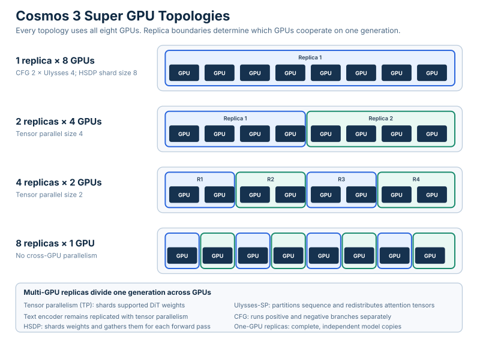
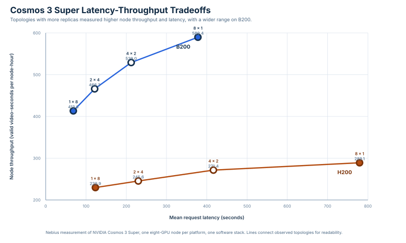

<!-- register: public technical repository | reader: GPU inference operators | consumed: GitHub desktop and terminal -->
<!-- generated by reproduce/render-benchmarks.py from the three embedded result records -->

# Cosmos3-Super serving benchmarks

The primary study contains 17 cells and 408 attempts: 240 attempts across ten B200 cells and 168 attempts across seven H200 cells. All 408 attempts passed the technical MP4 gate. Technical validity covers file integrity, complete decode, shape, duration, spatial detail, and frame-to-frame change. It does not score prompt adherence, visual quality, temporal consistency, physical plausibility, realism, human acceptance, or training utility.

The four primary rows compare complete serving topologies. Replica count, GPUs per replica, and parallel configuration change together. The measurements do not isolate one of those factors as the cause.

## The profiles select different operating points

| Topology | Named profile | B200 mean latency | B200 video-s/node-hour | B200 throughput gain | H200 mean latency | H200 video-s/node-hour | H200 throughput gain |
| --- | --- | ---: | ---: | ---: | ---: | ---: | ---: |
| 1 x 8 hybrid | `latency` | 68.5 s | 413.6 | +0.00% | 123.3 s | 229.9 | +0.00% |
| 2 x 4 TP-4 | `explicit override` | 121.5 s | 466.3 | +12.74% | 230.0 s | 245.6 | +6.83% |
| 4 x 2 TP-2 | `balanced` | 212.4 s | 529.0 | +27.90% | 416.5 s | 271.4 | +18.05% |
| 8 x 1 TP-1 | `throughput` | 378.1 s | 589.4 | +42.50% | 779.0 s | 289.1 | +25.75% |

Eight single-GPU replicas produced the highest node throughput among the four measured topologies for the pinned workload on both platforms. One eight-GPU hybrid replica produced the lowest request latency.

The `balanced` profile retains 89.8% of B200 8 x 1 node throughput with 43.8% lower mean latency. On H200 it retains 93.9% of node throughput with 46.5% lower mean latency.

These are workload-bounded profile descriptions, not universal optimality claims.

## B200 latency and node throughput

Source: [`results/b200-single-node-20260831.json`](results/b200-single-node-20260831.json). The B200 record combines two measurement sessions on the same node under one driver and container image.

| Cell | Role | Serving topology | Requests per replica | Valid / attempted | Mean latency | Median latency | P95 latency | Video-seconds / node-hour |
| --- | --- | --- | ---: | ---: | ---: | ---: | ---: | ---: |
| `T1_1x8` | primary | 1 replica x 8 GPUs, hybrid CFG-2 x Ulysses-4 x HSDP-8, concurrency 1 | 1 | 24 / 24 | 68.546 s | 68.537 s | 68.734 s | 413.6 |
| `T2_2x4` | primary | 2 replicas x 4 GPUs, tensor parallel, concurrency 1 | 1 | 24 / 24 | 121.509 s | 121.526 s | 121.670 s | 466.3 |
| `T3_4x2` | primary | 4 replicas x 2 GPUs, tensor parallel, concurrency 1 | 1 | 24 / 24 | 212.423 s | 212.293 s | 214.576 s | 529.0 |
| `T4_8x1` | primary | 8 replicas x 1 GPU, concurrency 1 | 1 | 24 / 24 | 378.109 s | 377.885 s | 384.779 s | 589.4 |
| `T1C2` | concurrency | 1 replica x 8 GPUs, hybrid, concurrency 2 | 2 | 24 / 24 | 100.861 s | 100.910 s | 132.897 s | 427.0 |
| `T2C2` | concurrency | 2 replicas x 4 GPUs, tensor parallel, concurrency 2 | 2 | 24 / 24 | 179.498 s | 179.262 s | 238.337 s | 476.1 |
| `T3C2` | concurrency | 4 replicas x 2 GPUs, tensor parallel, concurrency 2 | 2 | 24 / 24 | 316.030 s | 315.174 s | 423.462 s | 535.5 |
| `T4C2` | concurrency | 8 replicas x 1 GPU, concurrency 2 | 2 | 24 / 24 | 502.579 s | 381.709 s | 761.937 s | 591.8 |
| `T1R` | repeat | 1 replica x 8 GPUs, hybrid, concurrency 1, delayed repeat of T1_1x8 | 1 | 24 / 24 | 68.629 s | 68.601 s | 68.892 s | 413.1 |
| `T1C2R` | repeat | 1 replica x 8 GPUs, hybrid, concurrency 2, delayed repeat of T1C2 | 2 | 24 / 24 | 101.019 s | 101.082 s | 133.116 s | 426.4 |

## H200 latency and node throughput

Source: [`results/h200-single-node-20260831.json`](results/h200-single-node-20260831.json). The matched software and workload controls are the same as the B200 record. GPU model and memory, VBIOS, host CPU, host memory, and instance preset differ.

| Cell | Role | Serving topology | Requests per replica | Valid / attempted | Mean latency | Median latency | P95 latency | Video-seconds / node-hour |
| --- | --- | --- | ---: | ---: | ---: | ---: | ---: | ---: |
| `H1_1x8` | primary | 1 replica x 8 GPUs, hybrid CFG-2 x Ulysses-4 x HSDP-8, concurrency 1 | 1 | 24 / 24 | 123.282 s | 123.295 s | 123.424 s | 229.9 |
| `H2_2x4` | primary | 2 replicas x 4 GPUs, tensor parallel, concurrency 1 | 1 | 24 / 24 | 229.984 s | 229.911 s | 231.642 s | 245.6 |
| `H3_4x2` | primary | 4 replicas x 2 GPUs, tensor parallel, concurrency 1 | 1 | 24 / 24 | 416.514 s | 416.524 s | 417.965 s | 271.4 |
| `H4_8x1` | primary | 8 replicas x 1 GPU, concurrency 1 | 1 | 24 / 24 | 779.046 s | 779.716 s | 784.516 s | 289.1 |
| `H2C2` | concurrency | 2 replicas x 4 GPUs, tensor parallel, concurrency 2 | 2 | 24 / 24 | 342.181 s | 341.890 s | 455.381 s | 249.1 |
| `H3C2` | concurrency | 4 replicas x 2 GPUs, tensor parallel, concurrency 2 | 2 | 24 / 24 | 623.198 s | 621.034 s | 831.786 s | 272.7 |
| `H1R` | repeat | 1 replica x 8 GPUs, hybrid, concurrency 1, delayed repeat of H1_1x8 | 1 | 24 / 24 | 123.341 s | 123.356 s | 123.487 s | 229.8 |

## Concurrency two added latency for small throughput changes

| Platform | Topology cell | Concurrency-two cell | Node-throughput change | Mean-latency change |
| --- | --- | --- | ---: | ---: |
| B200 | `T1_1x8` | `T1C2` | +3.24% | +47.14% |
| B200 | `T2_2x4` | `T2C2` | +2.10% | +47.72% |
| B200 | `T3_4x2` | `T3C2` | +1.23% | +48.77% |
| B200 | `T4_8x1` | `T4C2` | +0.41% | +32.92% |
| H200 | `H2_2x4` | `H2C2` | +1.43% | +48.78% |
| H200 | `H3_4x2` | `H3C2` | +0.48% | +49.62% |

Concurrency-two cells are bimodal because the second request at a replica waits for the first. The table uses mean latency so both the fast and queued groups contribute to the comparison.

## Delayed repeats bound within-node drift

| Platform | Original | Delayed repeat | Node-throughput change | Mean-latency change |
| --- | --- | --- | ---: | ---: |
| B200 | `T1_1x8` | `T1R` | -0.12% | +0.12% |
| B200 | `T1C2` | `T1C2R` | -0.14% | +0.16% |
| H200 | `H1_1x8` | `H1R` | -0.04% | +0.05% |

## The earlier B200 record corroborates the topology ordering

[`results/b200-topology.json`](results/b200-topology.json) contains 147 attempts across seven cells. It supports the same topology ordering and is excluded from the main 408-attempt count.

| Cell | Role | Serving topology | Requests per replica | Valid / attempted | Mean latency | Median latency | P95 latency | Video-seconds / node-hour |
| --- | --- | --- | ---: | ---: | ---: | ---: | ---: | ---: |
| `T1_1x8` | primary | 1 replica x 8 GPUs, CFG-2 x Ulysses-4 x HSDP-8 | 1 | 24 / 24 | 67.920 s | 67.870 s | 68.266 s | 417.4 |
| `T2_2x4` | primary | 2 replicas x 4 GPUs, TP-4 | 1 | 24 / 24 | 120.133 s | 120.108 s | 120.338 s | 471.6 |
| `T3_4x2` | primary | 4 replicas x 2 GPUs, TP-2 | 1 | 24 / 24 | 210.569 s | 210.722 s | 211.117 s | 537.3 |
| `T4_8x1` | primary | 8 replicas x 1 GPU, TP-1 | 1 | 24 / 24 | 375.709 s | 376.304 s | 379.399 s | 597.6 |
| `T1C2` | concurrency | 1 replica x 8 GPUs, concurrency 2 | 2 | 24 / 24 | 100.042 s | 100.024 s | 131.845 s | 430.5 |
| `T4C2` | concurrency | 8 replicas x 1 GPU, concurrency 2 | 2 | 24 / 24 | 499.211 s | 378.128 s | 751.638 s | 600.4 |
| `T1DRIFT` | drift | 1 replica x 8 GPUs, post-sequence drift check | 1 | 3 / 3 | 68.360 s | 67.815 s | 69.538 s | 414.7 |

## Metrics and boundaries

Request latency is client wall time from dispatch through receipt and persistence of the complete MP4. Post-response validation is outside the request and production-window timers. Node throughput is validator-passing video duration divided by the production-window makespan, normalized to one node-hour. Failed and rejected attempts contribute no video-seconds while their elapsed time remains in the production window. Warmup, service construction, and model loading are outside the production window.

The primary records contain 408 technically valid attempts out of 408. Run `python3 reproduce/render-benchmarks.py --check` to detect table drift and `python3 reproduce/derive-results.py --verify-embedded <record>` to rederive every aggregate.

The exact control set and formulas are in [`reproduce/METHOD.md`](reproduce/METHOD.md). Commands for no-GPU verification, one-cell reproduction, the full v1 matrix, and routed v2 measurement are in [`reproduce/REPRODUCE.md`](reproduce/REPRODUCE.md).
