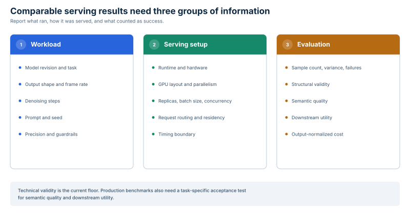

<!-- register: public benchmark methodology | reader: performance engineers and reviewers | consumed: evidence review on GitHub -->

# Cosmos3-Super serving benchmark method

This method defines the v1 evidence contract used for the August 31, 2026 single-node records. It measures complete serving topologies for the `nvidia/Cosmos3-Super` text-to-video Generator path through the pinned vLLM-Omni container.

## Workload controls fix the generated request

| Field | Fixed value |
| --- | --- |
| Model | `nvidia/Cosmos3-Super` |
| Model revision | `e0262be9d8f7586bc24c069a2aed2b665bdff266` |
| Task and precision | text to video, Generator tower, BF16 |
| Prompt | model snapshot `assets/example_t2v_prompt.json`, UTF-8 text with leading and trailing whitespace stripped, SHA-256 `61c9c4b46b6787d967cc509a2bf323766e70bf5ecf40e09a739362beac135677` |
| Negative prompt | model snapshot `assets/negative_prompt.json`, same normalization, SHA-256 `007a1bdfe1ec3edf3b9a71789ca1999a47ad565560f269a3d78bf9a8dfef9cfd` |
| Seeds | 17, 23, and 41, cycled by attempt index within each replica |
| Resolution | 1280 x 720 |
| Frames and rate | 189 frames at 24 fps |
| Output duration | 7.875 seconds for each technically valid clip |
| Denoising | 35 steps, guidance 6.0, flow shift 10.0 |
| Maximum sequence length | 4096 |
| Templates | resolution and duration templates disabled through `extra_params` |
| Guardrails | disabled |
| Endpoint | `POST /v1/videos/sync` with client and server timeout of 5400 seconds |

Prompt text is read from the operator's local model snapshot. Public records contain hashes, never prompt text.

## Serving configuration pins the public stack

| Field | Fixed value |
| --- | --- |
| Container | `vllm/vllm-omni:cosmos3@sha256:6d2630c7d637b699557573f2c3fee8df5d4d0cd718977aa22549ed6a6ef30587` |
| Runtime | vLLM 0.25.0 inside the image |
| PyTorch | 2.11.0+cu130 |
| CUDA | 13.0 |
| NCCL | 2.28.9 |
| Transformers | 5.13.0 |
| Docker | 29.7.0 for the matched B200/H200 records |
| Host OS | Ubuntu 24.04 |
| Node width | eight GPUs, every topology fills the node |

A serving topology combines replica count, GPUs assigned to each replica, and the parallel configuration within each replica. Each replica is an independent vLLM-Omni container with a disjoint GPU group and loopback endpoint.

| Topology | Parallel configuration |
| --- | --- |
| 1 replica x 8 GPUs | CFG parallel size 2, Ulysses degree 4, HSDP shard size 8, Ring degree 1 |
| 2 replicas x 4 GPUs | tensor parallel size 4 per replica |
| 4 replicas x 2 GPUs | tensor parallel size 2 per replica |
| 8 replicas x 1 GPU | tensor parallel size 1 per replica |

CFG, Ulysses, and HSDP operate across overlapping dimensions of the same eight GPUs in the hybrid topology. They do not describe a 64-rank deployment.

## Technical validity gates every attempt

An attempt is technically valid only when it:

1. returns HTTP 200 under the declared timeout;
2. produces a non-empty MP4 that decodes from first to last frame;
3. reports 1280 x 720, exactly 189 frames, 24 fps, and 7.80 to 7.95 seconds;
4. contains spatial detail and change across five sampled frames.

`validate-video.py` implements the gate. Failed, refused, timed-out, corrupt, blank, frozen, and wrong-shape attempts remain in the attempt denominator. They contribute no generated video-seconds.

This gate does not score prompt adherence, visual quality, temporal consistency, physical plausibility, realism, human acceptance, or downstream training utility.

## Timing separates requests from post-response validation

Request latency is client wall time from dispatch through receipt and persistence of the complete MP4. Every replica completes one warmup request before the production window opens. The window starts immediately before the first production round and closes immediately after the final response is persisted.

The production window includes request routing, generation, MP4 encoding, replica skew, failed-attempt time, and the idle tail until the last attempt completes. It excludes service construction, model loading, warmup, and post-response MP4 validation.

The v1 runner dispatches synchronized rounds across all replicas. At concurrency one, each replica receives one request and the next round waits for every replica. At concurrency two, each round sends up to two requests per replica and waits for every request in that round. Seeds cycle independently by attempt index within each replica.

Node throughput is:

```text
technically valid clips x 7.875 video-seconds x 3600 / production-window seconds
```

Every topology uses the full node, so the primary throughput unit is generated video-seconds per node-hour. Video-seconds per GPU-hour is the node value divided by eight.



## Experimental factors cover topology, concurrency, and drift

The primary B200 record contains ten cells and 240 attempts:

- four concurrency-one topologies, 24 attempts each;
- four concurrency-two counterparts, 24 attempts each;
- delayed repeats of the 1 x 8 topology at concurrency one and two, 24 attempts each.

The B200 record combines two sessions on the same node under one driver and container image. Six cells ran in one session and four ran in the earlier session; the ten cells were not collected in one uninterrupted session.

The primary H200 record contains seven cells and 168 attempts:

- four concurrency-one topologies, 24 attempts each;
- concurrency-two counterparts for 2 x 4 and 4 x 2, 24 attempts each;
- one delayed repeat of the 1 x 8 topology, 24 attempts.

The earlier B200 record contains seven cells and 147 attempts. It corroborates the topology ordering and is excluded from the 408-attempt primary census.

Concurrency is requests in flight per replica. It is separate from replica count and from on-GPU parallelism. Concurrency-two latency is reported by the mean because each measured cell is bimodal: one group runs immediately and one group waits behind another request.

## Platform controls separate matched and differing fields

The canonical B200 and H200 records match on:

- NVIDIA driver 580.173.02;
- the container digest and runtime versions listed above;
- model revision, task, precision, prompts, seeds, request shape, sampler fields, guardrail posture, endpoint, and timeout;
- replica definitions, topology definitions, warmup, synchronized dispatch, timing boundaries, technical validator, attempt count, and formulas.

They differ in:

- GPU model and memory;
- VBIOS;
- host CPU model and core count;
- host memory;
- instance preset.

The absolute B200/H200 gap is therefore a matched-stack systems comparison, not a silicon-only measurement. H200 reproduced the B200 topology ordering for this workload; different absolute latency and throughput may still change an operator's preferred point.

## Public records support aggregate rederivation

| Record | Role | Cells | Attempts | Embedded inputs |
| --- | --- | ---: | ---: | --- |
| `results/b200-single-node-20260831.json` | primary B200 | 10 | 240 | per-attempt records and exact windows |
| `results/h200-single-node-20260831.json` | primary H200 | 7 | 168 | per-attempt records and exact windows |
| `results/b200-topology.json` | earlier B200 corroboration | 7 | 147 | per-attempt records and exact windows |
| `results/b200-serving-envelope.json` | supplemental observation | n/a | n/a | aggregate summary only |
| `results/h200-serving-envelope.json` | supplemental observation | n/a | n/a | aggregate summary only |
| `results/b200-environment.json` | supplemental environment | n/a | n/a | environment summary only |
| `results/h200-environment.json` | supplemental environment | n/a | n/a | environment summary only |

`derive-results.py` recomputes every aggregate and comparison from the embedded attempts and windows in the three rederivable records. The four supplemental files return `not_a_rederivable_record` with exit code 2 because their raw per-request inputs are absent.

All 408 primary attempts and all 147 earlier B200 attempts were matched by SHA-256 to source MP4s that passed `validate-video.py`. Generated clips, logs, prompt text, telemetry, local paths, infrastructure identifiers, and credentials are excluded from the public records.

## Scope and exclusions bound the claims

The primary result supports profile selection among the four measured complete topologies for this pinned workload and stack. It does not isolate replica count, GPU silicon, tensor parallelism, CFG parallelism, Ulysses sequence parallelism, or HSDP as a single causal factor.

The evidence excludes:

- ring parallelism greater than 1;
- other output shapes, model variants, engines, images, node sizes, batching strategies, and future runtime versions;
- semantic or human quality evaluation and downstream training utility;
- the Cosmos3-Super reasoner tower and model-quality rankings.

Supplemental startup, guardrail, determinism, and NVIDIA-grid observations have narrower controls and are documented separately in [`../OBSERVATIONS.md`](../OBSERVATIONS.md).

## Reproduction preserves v1 and separates v2

`benchmark.py` is the v1 runner. It normalizes and checks prompt hashes before measurement, uses synchronized rounds, records the response-completion window, performs technical validation afterward, and preserves every attempt when validation fails.

`benchmark-v2.py` measures a named deployment through the node-local router using a work-conserving closed loop. V2 includes routing and queue time in client latency and records router state. Full healthy profile capacity is the default precondition. Explicit expected healthy and unavailable counts support a separately labeled degraded-capacity control, and those counts must sum to the profile capacity. Its outputs use the distinct `cosmos3_super_serving_v2` comparison basis. V2 data cannot be appended to or presented as reproduction of the v1 records.

The complete command matrix and output contract are in [`REPRODUCE.md`](REPRODUCE.md).
